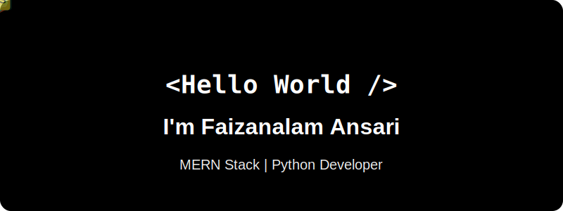

  

  I am a Computer Science Engineering student at LJ University specializing in building robust software, responsive web interfaces, and complex database architectures. I focus on bridging the gap between hardcore backend logic and flawless frontend design.

  🌱 <b>Currently focused on:</b> Mastering Full Stack Development (FSD) architecture & advanced database management. 
  💡 <b>Actively building:</b> Python-based data visualization dashboards and seamless UI/UX interfaces.

  
  

### 🛠️ Tech Stack & Arsenal

<b>💻 Frontend Development 💻</b>  

  

<b>⚙️ Backend & Databases ⚙️</b>  

  

<b>🐍 Python Ecosystem 🐍</b>  

 

### 🏆 Open to Hackathons & Collaborations

  Always down to build cool things under pressure! I'm actively looking for hackathon teams and open-source collaborations. Whether it's spinning up a quick React frontend or architecting a Django/PostgreSQL backend, let's combine our stacks and ship something massive. 🚀

### 📈 GitHub Analytics

  
  

### 🚀 Featured Engineering Projects

<table align="center" border="0" width="100%">
  <tr>
    <td width="50%" valign="top">
      <h3 align="center">🚗 Car Rental System</h3>
      
A robust, data-driven backend application utilizing <b>Python</b>, <b>PostgreSQL</b>, <b>Streamlit</b>, and <b>Matplotlib</b> for deep data management.

    </td>
    <td width="50%" valign="top">
      <h3 align="center">🚘 Car Fusion</h3>
      
A high-performance frontend project built purely with <b>HTML, CSS, JavaScript,</b> and <b>Bootstrap 5</b> for responsive UI/UX.

    </td>
  </tr>
</table>

 

